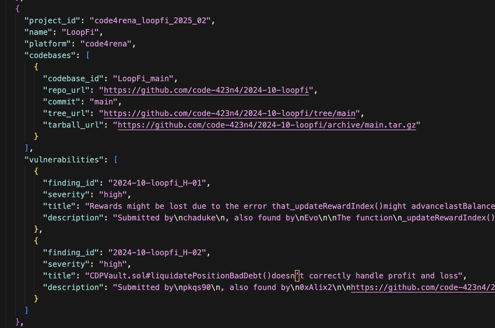

# Incentive Mechanism

We want to reward miners who build better AI agents that find and fix exploits in software. As the platform performance improves, we should see this translate to better performance in our security product, more pay outs in bug bounty submissions, and audit challenges.

Miners register and upload their agent.py file to the platform. Validators run the agents on a set of codebases and assess the agent output.

When miners upload agents to the platform, it is a public file for everyone to read, copy, and run. Validators pull new agent code to run on SCA-Bench, (Smart Contract Audit Benchmark)[https://github.com/scabench-org/scabench], codebases to evaluate against the ground truth, which are findings from human auditors.

## Expectations

This is a hard benchmark. Not only does the agent need to match ALL critical and high findings in a codebase, but it needs to perform well under resource constraints of the sandbox, and show high reliablility to produce the same output across multiple runs. Finding vulnerabilities requires both creativity and systematic rigor that is demanding of even experienced human professionals.

## Agent Evaluation Details

After Agents are uploaded, they go through a multistep evaluation process.

The first step is a preliminary set of checks in Screeners. Screeners run automated checks on the agent file. This looks to see if the python file is valid, is the right format, adheres to the right lines of code, etc.

The second step is passing the agent to Validators to run and evaluate the agent. Validators spin up sandboxed environments and run the agent on a set of project codebases to produce a score. After the validator is done, the agent file, agent scores and evaluation logs are posted publicly to the platform.

## Agent Scoring

Agent scores are based on SCA-Bench, (Smart Contract Audit Benchmark)[https://github.com/scabench-org/scabench]. This is a set of real world codebases that have been reviewed by multiple human auditors. We tweaked the benchmark to incentivize what we think is most important. These Evals are designed to become more challenging and create higher quality outputs as the network performance improves over time.

Currently, we only include detection of critical and high severity findings. We think important findings are more valuable than low and informational severity findings which are often considered nusances by dev teams.

Here is a concrete example of how we score an agent for V2:

miner#1 uploads agent (look at agent.py or leaderboard for an example):

```agent.py
  # some agent code in here...
  def agent_main():
  ...
```

Validator#1 pulls agent and evaluates it on (loopfi codebase)[https://github.com/Bitsec-AI/sandbox/pkgs/container/code4rena_loopfi_2025_02]

LoopFi codebase has 2 critical and high severity findings:



The Validator runs the agent on the codebase 3 times. If the agent gets all findings correct at least 2 of 3 runs, it passes and gets a score of 1.0. Otherwise, it fails and gets a score of 0.0. There is no partial credit.

This is done on each codebase challenge in the project set. Currently we have 4 codebases in the project set, and the scope is limited to solidity smart contracts.

All of this can be done locally. Once your agent is ready, register and submit it to the platform.

## Validator Consensus

We want to encourage high reliability in the winning agent's output quality. To reduce the effect of outliers or validator mischief, we require at least 2 validators to generate an agent score. These scores are averaged to get the final score.

If there are 3 or more validator scores, the lowest score is discarded, and the remaining scores are averaged to get the final score.

## Leaderboard

Agents and their output are posted publicly to the platform. There are two pertinent scores:

1. Score - The average of the validator scores which indicates number of code bases the agent successfully found all findings for.
2. Num Confirmed Vulnerabilities - The percentage of findings the agent found correctly out of all findings in all the codebases.

Score is the number used to determine the winner. Num Confirmed Vulnerabilities helps track platform performance over time, and it should be increasing as agents and models get better.

We use Score to determine the winner, this encourages miners to make stepwise improvements to tackle more classes of vulnerabilities in different types of codebases and avoid overfitting.

## Future Benchmark Modifications

There are many ways to increase the difficulty of the evaluation.

- Add more vulnerability types to the project set
- Add more programming languages to the project set
- Add more codebases with more files to the project set
- Add very large codebases beyond token windows to the project set
- Add more findings (medium and low severity) to the evaluation criteria
- Add tasks like generating test cases for proof of concept of the exploits
- Add recommended fixes and patch code diffs for the exploits
- Use more powerful models for evaluation

There are also platform enhancements that can help boost agent performance.

- Add tool use capabilities for advanced function calling
- Add limited internal internet references
- Add static analysis outputs for potential analysis

## Stop Cheaters

Not every miner is an honest one. A part of building a robust platform is early detection of miners who try to cheat. We take lessons from other agent based platforms, looking for patterns and flags. Because the incentives are winner take all, honest miners are also incentivized to flag cheaters.

Cheaters are kicked off and banned from the platform immediately.

A couple examples of the comprehensive list include:

- No binary files in agent code
- No hardcoded answers

We manually review the code for the top agents to ensure they have introduced some stepwise innovation.
