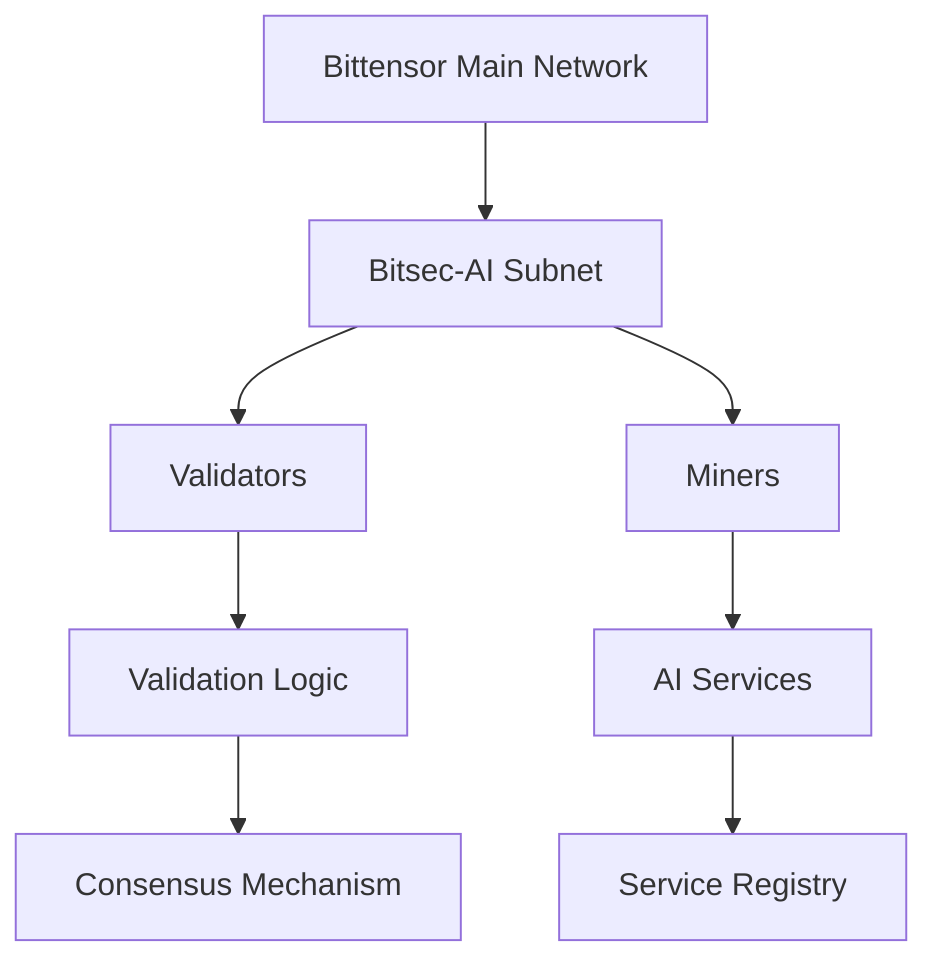

# Subnet Architecture

Understanding the Bitsec-AI subnet architecture is crucial for effective operation as a validator or miner. This guide provides a comprehensive overview of the system design and components.

## Overview

The Bitsec-AI subnet operates as a specialized layer within the Bittensor network, focusing on secure and reliable AI infrastructure services. The architecture is designed for scalability, security, and decentralization.

## Core Components

### Network Layer



#### Bittensor Integration
- **Netuid**: Unique subnet identifier within Bittensor
- **TAO Integration**: Native token for rewards and staking
- **Consensus**: Participates in Bittensor's consensus mechanism
- **Metagraph**: Maintains network state and participant information

### Validator Architecture

#### Core Functions

1. **Service Validation**
   - Quality assessment of miner outputs
   - Performance benchmarking
   - Security compliance verification

2. **Network Governance**
   - Consensus participation
   - Protocol upgrade voting
   - Network parameter adjustment

3. **Economic Management**
   - Reward distribution
   - Stake management
   - Slashing condition enforcement

#### Technical Components

```python
class ValidatorNode:
    def __init__(self):
        self.consensus_engine = ConsensusEngine()
        self.validation_logic = ValidationLogic()
        self.economic_engine = EconomicEngine()
        self.network_interface = NetworkInterface()
    
    def validate_miner_output(self, miner_id, output):
        # Implement validation logic
        pass
    
    def participate_in_consensus(self):
        # Consensus participation
        pass
```

### Miner Architecture

#### Service Categories

1. **AI Inference Services**
   - Text processing and generation
   - Image analysis and generation
   - Code completion and analysis
   - Data processing and analytics

2. **Infrastructure Services**
   - Compute resource provision
   - Storage services
   - Network services
   - Security services

#### Technical Stack

```python
class MinerNode:
    def __init__(self):
        self.service_engine = ServiceEngine()
        self.resource_manager = ResourceManager()
        self.api_interface = APIInterface()
        self.security_layer = SecurityLayer()
    
    def provide_service(self, request):
        # Service provision logic
        pass
    
    def register_capabilities(self):
        # Capability registration
        pass
```

## Data Flow Architecture

### Request Processing Flow

1. **Service Request Initiation**
   ```
   Client → API Gateway → Load Balancer → Miner Selection
   ```

2. **Miner Processing**
   ```
   Selected Miner → Service Execution → Response Generation
   ```

3. **Validation Process**
   ```
   Miner Response → Validator Evaluation → Quality Assessment → Consensus
   ```

4. **Reward Distribution**
   ```
   Consensus Result → Economic Engine → Reward Calculation → Distribution
   ```

### Data Storage

#### On-Chain Data
- Network metadata and parameters
- Participant registrations and stakes
- Consensus results and rewards
- Governance decisions and votes

#### Off-Chain Data
- Service request/response logs
- Performance metrics and analytics
- Private computation results
- Cached frequently accessed data

## Security Architecture

### Multi-Layer Security

#### Network Security
```yaml
security_layers:
  network:
    - DDoS protection
    - Rate limiting
    - IP filtering
    - Encrypted communications
  
  application:
    - Authentication and authorization
    - Input validation and sanitization
    - Output verification
    - API security
  
  consensus:
    - Byzantine fault tolerance
    - Sybil attack prevention
    - Economic security mechanisms
    - Slashing conditions
```

#### Cryptographic Foundations

1. **Identity Management**
   - Cryptographic key pairs for each participant
   - Digital signatures for all transactions
   - Zero-knowledge proofs for privacy

2. **Communication Security**
   - TLS/SSL for all network communications
   - End-to-end encryption for sensitive data
   - Message authentication codes

3. **Data Integrity**
   - Merkle trees for data verification
   - Hash-based integrity checks
   - Immutable audit logs

## Scalability Design

### Horizontal Scaling

#### Validator Scaling
- Multiple validator nodes for redundancy
- Load balancing across validators
- Geographic distribution for latency optimization

#### Miner Scaling
- Dynamic miner registration and deregistration
- Auto-scaling based on demand
- Resource pooling and sharing

### Vertical Scaling

#### Performance Optimization
- Efficient algorithms and data structures
- Caching strategies for frequently accessed data
- Database optimization and indexing

#### Resource Management
```python
class ResourceManager:
    def __init__(self):
        self.cpu_pool = CPUPool()
        self.gpu_pool = GPUPool()
        self.memory_pool = MemoryPool()
        self.storage_pool = StoragePool()
    
    def allocate_resources(self, request):
        # Resource allocation logic
        return self.optimize_allocation(request)
    
    def monitor_utilization(self):
        # Resource monitoring
        pass
```

## Consensus Mechanism

### Proof-of-Intelligence (PoI)

The subnet implements a custom consensus mechanism based on the quality and utility of AI services provided:

#### Validation Criteria
1. **Accuracy**: Correctness of outputs
2. **Efficiency**: Resource utilization and speed
3. **Innovation**: Novel approaches and improvements
4. **Reliability**: Consistent performance over time

#### Consensus Algorithm
```python
class ConsensusEngine:
    def __init__(self):
        self.validators = []
        self.consensus_threshold = 0.67
    
    def reach_consensus(self, validation_results):
        # Aggregate validator opinions
        weighted_scores = self.calculate_weighted_scores(validation_results)
        
        # Apply consensus algorithm
        consensus_score = self.apply_consensus_algorithm(weighted_scores)
        
        # Determine final result
        return consensus_score >= self.consensus_threshold
```

## Economic Model

### Token Economics

#### Reward Mechanisms
- **Base Rewards**: Fixed rewards for participation
- **Performance Rewards**: Variable rewards based on quality
- **Innovation Bonuses**: Extra rewards for novel contributions
- **Staking Rewards**: Returns on staked tokens

#### Cost Structure
- **Network Fees**: Transaction and service fees
- **Slashing Penalties**: Penalties for malicious behavior
- **Infrastructure Costs**: Operational expenses

### Incentive Alignment

The economic model is designed to align participant incentives with network goals:

```python
class EconomicEngine:
    def calculate_rewards(self, participant_id, performance_metrics):
        base_reward = self.get_base_reward()
        performance_multiplier = self.calculate_performance_multiplier(performance_metrics)
        innovation_bonus = self.calculate_innovation_bonus(participant_id)
        
        total_reward = base_reward * performance_multiplier + innovation_bonus
        return total_reward
    
    def apply_slashing(self, participant_id, violation_type):
        # Slashing logic for violations
        pass
```

## Network Topology

### Physical Architecture

#### Global Distribution
- Multiple geographic regions for redundancy
- Edge nodes for reduced latency
- Content delivery network integration

#### Network Connectivity
```yaml
network_topology:
  regions:
    - us-east: 
        validators: 10
        miners: 100
    - eu-west:
        validators: 8
        miners: 80
    - asia-pacific:
        validators: 12
        miners: 120
  
  connectivity:
    inter_region_latency: <100ms
    intra_region_latency: <10ms
    bandwidth: >1Gbps
```

### Logical Architecture

#### Service Mesh
- Microservices architecture for modularity
- Service discovery and registration
- Load balancing and failover
- Circuit breakers for resilience

## Monitoring and Observability

### System Metrics

#### Network-Level Metrics
- Transaction throughput and latency
- Consensus timing and participation
- Network topology and connectivity
- Security incident detection

#### Service-Level Metrics
- Request/response patterns
- Service quality scores
- Resource utilization
- Error rates and types

### Alerting and Automation

```python
class MonitoringSystem:
    def __init__(self):
        self.metrics_collector = MetricsCollector()
        self.alert_manager = AlertManager()
        self.auto_scaler = AutoScaler()
    
    def monitor_network_health(self):
        metrics = self.metrics_collector.collect_all()
        
        if self.detect_anomaly(metrics):
            self.alert_manager.send_alert()
            self.auto_scaler.adjust_capacity()
```

## Future Architecture Evolution

### Planned Enhancements

1. **Layer 2 Integration**: State channels and sidechains
2. **Interoperability**: Cross-chain communication protocols
3. **AI Model Registry**: Decentralized model sharing and versioning
4. **Privacy Enhancements**: Zero-knowledge proofs and federated learning

### Research Directions

- Quantum-resistant cryptography
- Advanced consensus mechanisms
- AI-driven network optimization
- Sustainable computing practices

## Conclusion

The Bitsec-AI subnet architecture provides a robust, scalable, and secure foundation for decentralized AI services. Understanding these architectural principles is essential for effective participation as either a validator or miner.

The architecture continues to evolve based on network needs, technological advances, and community feedback. Stay engaged with the development community to understand upcoming changes and improvements.