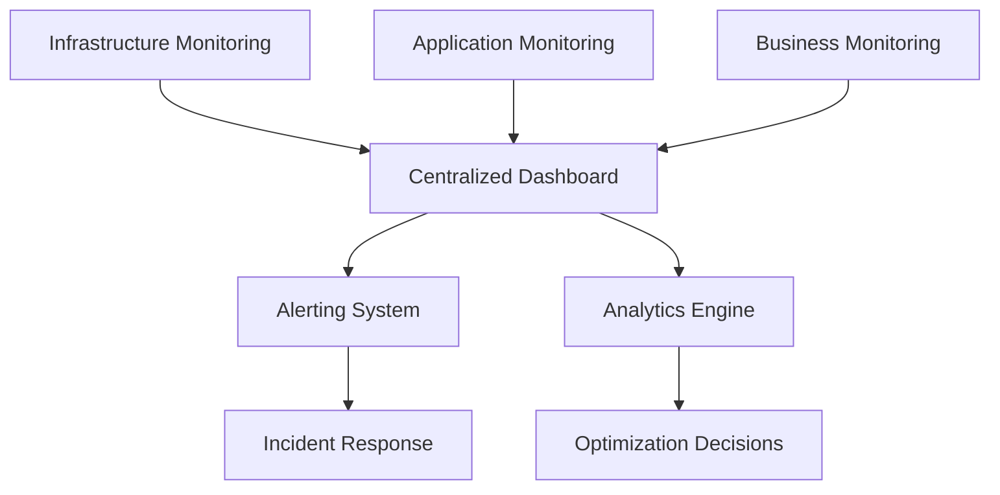

# Monitoring and Observability

Comprehensive monitoring is essential for maintaining a healthy and efficient operation in the Bitsec-AI subnet. This guide covers monitoring strategies, tools, and best practices for both validators and miners.

## Overview

Effective monitoring provides:

- **Real-time visibility** into system performance
- **Early warning** of potential issues
- **Performance optimization** insights
- **Compliance verification** with network requirements
- **Economic tracking** of earnings and costs

## Monitoring Architecture

### Three-Tier Monitoring Model



## Infrastructure Monitoring

### System Metrics

#### Core System Metrics

```yaml
system_metrics:
  cpu:
    - utilization_percent
    - load_average
    - core_temperature
    - frequency_scaling
  
  memory:
    - usage_percent
    - available_memory
    - swap_usage
    - memory_leaks
  
  disk:
    - usage_percent
    - io_operations_per_second
    - read_write_latency
    - disk_health_status
  
  network:
    - bandwidth_utilization
    - packet_loss_rate
    - connection_count
    - latency_metrics
```

#### GPU Monitoring (For Miners)

```bash
# NVIDIA GPU monitoring script
#!/bin/bash

while true; do
    nvidia-smi --query-gpu=timestamp,name,temperature.gpu,utilization.gpu,utilization.memory,memory.total,memory.free,memory.used --format=csv,noheader,nounits >> gpu_metrics.log
    sleep 10
done
```

### Infrastructure Monitoring Tools

#### System Monitoring with Prometheus

```yaml
# prometheus.yml
global:
  scrape_interval: 15s

scrape_configs:
  - job_name: 'node-exporter'
    static_configs:
      - targets: ['localhost:9100']
  
  - job_name: 'gpu-exporter'
    static_configs:
      - targets: ['localhost:9101']
  
  - job_name: 'validator-metrics'
    static_configs:
      - targets: ['localhost:8080']
```

#### Grafana Dashboard Configuration

```json
{
  "dashboard": {
    "title": "Bitsec-AI Node Monitoring",
    "panels": [
      {
        "title": "CPU Usage",
        "type": "graph",
        "targets": [
          {
            "expr": "100 - (avg(irate(node_cpu_seconds_total{mode=\"idle\"}[5m])) * 100)"
          }
        ]
      },
      {
        "title": "Memory Usage",
        "type": "graph",
        "targets": [
          {
            "expr": "(node_memory_MemTotal_bytes - node_memory_MemAvailable_bytes) / node_memory_MemTotal_bytes * 100"
          }
        ]
      }
    ]
  }
}
```

## Application Monitoring

### Validator Monitoring

#### Key Validator Metrics

```python
class ValidatorMetrics:
    def __init__(self):
        self.metrics = {
            'validation_requests_per_second': 0,
            'average_validation_time': 0,
            'consensus_participation_rate': 0,
            'reward_rate': 0,
            'network_connectivity_score': 0,
            'validator_rank': 0,
            'uptime_percentage': 0
        }
    
    def collect_metrics(self):
        # Collect and update metrics
        self.update_validation_metrics()
        self.update_economic_metrics()
        self.update_network_metrics()
        
        return self.metrics
```

#### Validator Health Checks

```python
import asyncio
import aiohttp
from datetime import datetime

class ValidatorHealthMonitor:
    def __init__(self, validator_endpoints):
        self.endpoints = validator_endpoints
        self.health_status = {}
    
    async def health_check(self, endpoint):
        try:
            async with aiohttp.ClientSession() as session:
                async with session.get(f"{endpoint}/health", timeout=5) as response:
                    if response.status == 200:
                        return {"status": "healthy", "timestamp": datetime.now()}
                    else:
                        return {"status": "unhealthy", "timestamp": datetime.now()}
        except Exception as e:
            return {"status": "error", "error": str(e), "timestamp": datetime.now()}
    
    async def monitor_all_validators(self):
        tasks = [self.health_check(endpoint) for endpoint in self.endpoints]
        results = await asyncio.gather(*tasks)
        
        for i, result in enumerate(results):
            self.health_status[self.endpoints[i]] = result
        
        return self.health_status
```

### Miner Monitoring

#### Key Miner Metrics

```python
class MinerMetrics:
    def __init__(self):
        self.metrics = {
            'requests_processed_per_hour': 0,
            'average_response_time': 0,
            'accuracy_score': 0,
            'resource_utilization': {
                'cpu': 0,
                'memory': 0,
                'gpu': 0,
                'disk': 0
            },
            'earnings_per_hour': 0,
            'rejection_rate': 0,
            'service_availability': 0
        }
    
    def collect_metrics(self):
        # Implementation details
        pass
```

#### Service Quality Monitoring

```python
import time
from functools import wraps

def monitor_service_quality(func):
    @wraps(func)
    async def wrapper(*args, **kwargs):
        start_time = time.time()
        
        try:
            result = await func(*args, **kwargs)
            
            # Calculate metrics
            response_time = time.time() - start_time
            success = True
            
            # Log metrics
            await log_service_metrics({
                'function': func.__name__,
                'response_time': response_time,
                'success': success,
                'timestamp': time.time()
            })
            
            return result
            
        except Exception as e:
            # Log error metrics
            await log_service_metrics({
                'function': func.__name__,
                'response_time': time.time() - start_time,
                'success': False,
                'error': str(e),
                'timestamp': time.time()
            })
            raise
    
    return wrapper
```

## Business Monitoring

### Economic Metrics

#### Revenue Tracking

```python
class EconomicMonitor:
    def __init__(self):
        self.economic_metrics = {
            'daily_earnings': 0,
            'monthly_earnings': 0,
            'total_earnings': 0,
            'daily_costs': 0,
            'monthly_costs': 0,
            'profit_margin': 0,
            'roi_percentage': 0
        }
    
    def track_earnings(self, amount, timestamp):
        # Track earnings over time
        pass
    
    def track_costs(self, cost_type, amount, timestamp):
        # Track various cost types
        pass
    
    def calculate_profitability(self):
        # Calculate profitability metrics
        pass
```

#### Performance Benchmarking

```python
class PerformanceBenchmark:
    def __init__(self):
        self.benchmarks = {
            'network_average_response_time': 0,
            'network_average_accuracy': 0,
            'network_average_uptime': 0,
            'top_performer_metrics': {},
            'percentile_rankings': {}
        }
    
    def compare_performance(self, my_metrics):
        # Compare against network averages
        performance_score = self.calculate_relative_performance(my_metrics)
        return performance_score
```

## Alerting System

### Alert Configuration

```yaml
# alerting_rules.yml
groups:
- name: infrastructure_alerts
  rules:
  - alert: HighCPUUsage
    expr: cpu_usage_percent > 80
    for: 5m
    labels:
      severity: warning
    annotations:
      summary: "High CPU usage detected"
      description: "CPU usage is above 80% for more than 5 minutes"

  - alert: LowDiskSpace
    expr: disk_free_percent < 10
    for: 2m
    labels:
      severity: critical
    annotations:
      summary: "Low disk space"
      description: "Disk space is below 10%"

- name: application_alerts
  rules:
  - alert: ValidatorOffline
    expr: validator_uptime_percent < 95
    for: 1m
    labels:
      severity: critical
    annotations:
      summary: "Validator offline"
      description: "Validator uptime is below 95%"

  - alert: LowMiningRewards
    expr: hourly_mining_rewards < mining_reward_threshold
    for: 30m
    labels:
      severity: warning
    annotations:
      summary: "Low mining rewards"
      description: "Mining rewards are below expected threshold"
```

### Alert Channels

```python
class AlertManager:
    def __init__(self):
        self.channels = {
            'email': EmailChannel(),
            'slack': SlackChannel(),
            'telegram': TelegramChannel(),
            'sms': SMSChannel()
        }
    
    async def send_alert(self, alert, severity):
        message = self.format_alert_message(alert, severity)
        
        # Send to appropriate channels based on severity
        if severity == 'critical':
            await self.send_to_all_channels(message)
        elif severity == 'warning':
            await self.send_to_primary_channels(message)
        else:
            await self.send_to_log_channel(message)
```

## Logging and Observability

### Structured Logging

```python
import logging
import json
from datetime import datetime

class StructuredLogger:
    def __init__(self, service_name):
        self.service_name = service_name
        self.logger = logging.getLogger(service_name)
        
        # Configure JSON formatter
        handler = logging.StreamHandler()
        formatter = logging.Formatter('%(message)s')
        handler.setFormatter(formatter)
        self.logger.addHandler(handler)
        self.logger.setLevel(logging.INFO)
    
    def log(self, level, message, **kwargs):
        log_entry = {
            'timestamp': datetime.utcnow().isoformat(),
            'service': self.service_name,
            'level': level,
            'message': message,
            **kwargs
        }
        
        if level == 'error':
            self.logger.error(json.dumps(log_entry))
        elif level == 'warning':
            self.logger.warning(json.dumps(log_entry))
        else:
            self.logger.info(json.dumps(log_entry))
```

### Distributed Tracing

```python
from opentelemetry import trace
from opentelemetry.exporter.jaeger.thrift import JaegerExporter
from opentelemetry.sdk.trace import TracerProvider
from opentelemetry.sdk.trace.export import BatchSpanProcessor

class DistributedTracing:
    def __init__(self):
        # Set up Jaeger exporter
        jaeger_exporter = JaegerExporter(
            agent_host_name="jaeger-agent",
            agent_port=6831,
        )
        
        # Set up tracer provider
        trace.set_tracer_provider(TracerProvider())
        tracer_provider = trace.get_tracer_provider()
        
        # Add span processor
        span_processor = BatchSpanProcessor(jaeger_exporter)
        tracer_provider.add_span_processor(span_processor)
        
        self.tracer = trace.get_tracer(__name__)
    
    def trace_operation(self, operation_name):
        def decorator(func):
            def wrapper(*args, **kwargs):
                with self.tracer.start_as_current_span(operation_name):
                    return func(*args, **kwargs)
            return wrapper
        return decorator
```

## Monitoring Tools and Setup

### Tool Stack Recommendations

#### Open Source Stack
```yaml
monitoring_stack:
  metrics_collection:
    - prometheus
    - node_exporter
    - gpu_exporter
  
  visualization:
    - grafana
    - kibana
  
  logging:
    - elasticsearch
    - logstash
    - fluentd
  
  alerting:
    - alertmanager
    - pushover
  
  tracing:
    - jaeger
    - zipkin
```

#### Commercial Alternatives
- DataDog
- New Relic
- Splunk
- Elastic Cloud

### Installation Scripts

#### Docker Compose Setup

```yaml
# docker-compose.monitoring.yml
version: '3.8'

services:
  prometheus:
    image: prom/prometheus:latest
    ports:
      - "9090:9090"
    volumes:
      - ./prometheus.yml:/etc/prometheus/prometheus.yml
      - ./alerting_rules.yml:/etc/prometheus/alerting_rules.yml

  grafana:
    image: grafana/grafana:latest
    ports:
      - "3000:3000"
    volumes:
      - grafana-storage:/var/lib/grafana
    environment:
      - GF_SECURITY_ADMIN_PASSWORD=admin

  node-exporter:
    image: prom/node-exporter:latest
    ports:
      - "9100:9100"
    volumes:
      - /proc:/host/proc:ro
      - /sys:/host/sys:ro
      - /:/rootfs:ro

  alertmanager:
    image: prom/alertmanager:latest
    ports:
      - "9093:9093"
    volumes:
      - ./alertmanager.yml:/etc/alertmanager/alertmanager.yml

volumes:
  grafana-storage:
```

### Automated Setup Script

```bash
#!/bin/bash
# setup_monitoring.sh

echo "Setting up Bitsec-AI monitoring stack..."

# Install Docker and Docker Compose
sudo apt update
sudo apt install -y docker.io docker-compose

# Create monitoring directory
mkdir -p ~/bitsec-monitoring
cd ~/bitsec-monitoring

# Download configuration files
wget https://raw.githubusercontent.com/Bitsec-AI/docs/main/monitoring/docker-compose.yml
wget https://raw.githubusercontent.com/Bitsec-AI/docs/main/monitoring/prometheus.yml
wget https://raw.githubusercontent.com/Bitsec-AI/docs/main/monitoring/alerting_rules.yml

# Start monitoring stack
docker-compose up -d

echo "Monitoring stack started!"
echo "Grafana: http://localhost:3000 (admin/admin)"
echo "Prometheus: http://localhost:9090"
echo "Alertmanager: http://localhost:9093"
```

## Best Practices

### Monitoring Best Practices

1. **Monitor What Matters**
   - Focus on user-facing metrics
   - Monitor business KPIs
   - Track resource utilization
   - Measure service quality

2. **Set Appropriate Thresholds**
   - Use historical data to set baselines
   - Account for normal variations
   - Implement graduated alerting

3. **Reduce Alert Fatigue**
   - Implement smart alerting rules
   - Use alert correlation
   - Provide actionable information

4. **Regular Review and Optimization**
   - Review metrics and alerts monthly
   - Update thresholds based on trends
   - Remove obsolete monitoring

### Security Considerations

1. **Secure Monitoring Infrastructure**
   - Use HTTPS for all communications
   - Implement authentication and authorization
   - Regularly update monitoring tools

2. **Data Privacy**
   - Avoid logging sensitive information
   - Implement data retention policies
   - Anonymize personal data

3. **Access Control**
   - Implement role-based access
   - Use principle of least privilege
   - Regular access review

## Troubleshooting Monitoring Issues

### Common Monitoring Problems

1. **High Cardinality Metrics**
   ```bash
   # Check metric cardinality
   curl -s 'http://localhost:9090/api/v1/label/__name__/values' | jq '.data | length'
   ```

2. **Missing Metrics**
   ```bash
   # Check if exporters are running
   curl -s http://localhost:9100/metrics | head -10
   ```

3. **Alert Fatigue**
   - Review alert frequency
   - Implement alert suppression
   - Use smarter alert rules

## Conclusion

Effective monitoring is crucial for successful operation in the Bitsec-AI subnet. Implement comprehensive monitoring covering infrastructure, applications, and business metrics. Use appropriate tools and follow best practices to maintain high availability and optimal performance.

Regular review and optimization of your monitoring setup ensures it continues to provide value and helps you stay competitive in the dynamic Bittensor ecosystem.